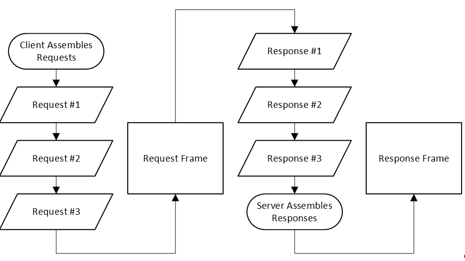

# Low-Latency Message Streaming over TCP/IP

Dan Parker


3/21/2016


This document outlines a method for efficient message streaming on networks where low latency is paramount by grouping messages into periodic frames.


This topic contains the following sections:
&nbsp;<ul><li><a href="#application-level-concurrency-in-windows">Application-Level Concurrency in Windows</a></li>&nbsp;
<li><a href="#low-latency-tcp/ip-communication-in-windows">Low Latency TCP/IP Communication in Windows</a></li>&nbsp;
<li><a href="#assembling-messages-into-a-sync-frame">Assembling messages into a sync frame</a></li>&nbsp;
<li><a href="#serializing-data">Serializing data</a></li>&nbsp;
<li><a href="#a-sample-c-messaging-client">A sample C# messaging client</a></li>&nbsp;
<li><a href="#passing-messages-vs.-implementing-a-service-contract">Passing messages vs. implementing a service contract</a></li>&nbsp;
<li><a href="#fault-handling">Fault Handling</a></li>&nbsp;
<li><a href="#see-also">See Also</a></li></ul>&nbsp;
This document outlines a method for efficient message streaming on networks where low latency is paramount by grouping messages into periodic frames. Examples will be provided in C#, although interoperability with C++ will also be addressed by selecting a portable method for binary serialization. We’ll try to establish and follow general guidelines for writing performant code, but focus on the Microsoft implementations of libraries and protocol layers for specific examples. Our focus is on writing a platform-agnostic (e.g. portable C#, and not built on “web services”, such as Azure or AWS) library that can efficiently stream multiple messages to and from a server in a single TCP/IP session.


## Application-Level Concurrency in Windows

With multi-core processors being a common way to achieve higher processing power, it’s a good idea to build applications that can utilize thread pooling. In this case, thread pooling could be taken to mean any scheme which avoids thread creation overhead by reusing threads out of a pool. There are various other asynchronous mechanisms in Windows, such as IO completion ports which can be used to avoid the overhead associated with creating extra threads by removing thread blocking patterns from code. Both the Default TaskScheduler for the Task Parallel Library in C#, and the C++ Microsoft implementation of std::async library can utilize thread pools (in current Visual Studio CRT releases, std::async’s async future implementation is built on top of ConcRT, which reuses threads.).


Both the std::async library and the TPL support concurrency programming through continuations. Continuations allow a single thread of execution to be broken up and evaluated across multiple threads as method results, such as IO completion, or long-running computations from other tasks, become available. Since continuation results can be passed between threads without being evaluated, and each part of a continuation is treated as a single method body, it’s easy to write code that takes advantage of multiple cores using continuations. The async/await keywords added to C# 4.5 also make it easy to write concurrent code based on multiple continuations while masking the underlying TPL code.


## Low Latency TCP/IP Communication in Windows

We want to focus on low latency bidirectional communication. TCP/IP is designed as a one-way protocol, with either one side sending data or the other side receiving data at any given point. Latency in this case being the amount of time it takes for a server to respond to a single request containing TCP data, such as a message. We’ll assume that a constant rate of data is being transmitted between a client and a server over a long enough period of time to make measuring average latency meaningful. We’ll also assume that average network latency for a single message in a client-server session is high enough to make any computational inefficiency resulting from serializing the data to a network a secondary concern. In reality it’s still a concern, but one that could be more easily optimized out later on than optimizing out round trip latency.


We’ll also assume, when possible, that the default modern TCP/IP implementation is correct in most cases. We won’t attempt to work around issues by disabling certain features of TCP/IP, such as by setting NODELAY. It seems intuitive, based on an understanding of TCP/IP mechanics, that a single, long-running session will transmit a larger request and receive the same response more quickly than a series of smaller requests being transmitted in sequence, each delivering smaller payloads. This is because less work needs to be done to fragment or reassemble individual packets, and less time needs to be spent on the round trip delay to acknowledge each individual message. I set up a simple TCP/IP server and an application running between 2 machines on different networks. To simplify the experiment, I assumed that any server or protocol level overhead from managing multiple sessions at once would be machine dependent, and could be safely factored out.


**Figure 1 The sample listing for my client-server application**<br />
``` C#
using System;
using System.Diagnostics;
using System.IO;
using System.Net;
using System.Net.Sockets;
using System.Text;

namespace ClientServer
{
    class Program
    {
        static void Main(string[] args)
        {
            if (args.Length == 0)
            {
                Usage();
            }

            try
            {

                if (args[0] == "listen")
                {
                    Listen(ParseEp(args[1]));
                }
                else if (args[0] == "transmit")
                {
                    Stopwatch sw = new Stopwatch();
                    sw.Start();
                    Transmit(ParseEp(args[1]), Int32.Parse(args[2]),
                    Int32.Parse(args[3]));
                    Console.Out.WriteLine("Elapsed: {0}ms",
                    sw.Elapsed.TotalMilliseconds);
                }
            }
            catch (Exception ex)
            {
                Console.Error.WriteLine("Caught an unhandled exception: {0}",
                ex.Message);
            }
        }

        static void Listen(IPEndPoint localEp)
        {
            TcpListener listener = new TcpListener(localEp);
            listener.Start();
            for (;;)
            {
                TcpClient client = listener.AcceptTcpClient();
                try
                {
                    using (BinaryReader sr = new BinaryReader(client.GetStream(),
                    Encoding.Default, true))
                    using (BinaryWriter sw = new BinaryWriter(client.GetStream(),
                    Encoding.Default, true))
                    {
                        int messageSize = sr.ReadInt32();
                        for (;;)
                        {
                            byte[] data = sr.ReadBytes(messageSize);
                            sw.Write((byte)0);
                        }
                    }
                }
                catch (Exception ex)
                {
                    Console.Error.WriteLine("Client closed: {0}", ex.ToString());
                }
                finally
                {
                    client.Close();
                }
            }
        }

        static void Transmit(IPEndPoint remoteEp, int numMessages,
        int bytesPerMessage)
        {
            TcpClient client = new TcpClient();
            try
            {
                Random r = new Random();
                byte[] buf = new byte[bytesPerMessage];

                client.Connect(remoteEp);

                using (BinaryReader sr = new BinaryReader(client.GetStream(),
                Encoding.Default, true))
                using (BinaryWriter sw = new BinaryWriter(client.GetStream(),
                Encoding.Default, true))
                {
                    sw.Write((int)bytesPerMessage);

                    for (int i = 0; i < numMessages; ++i)
                    {
                        r.NextBytes(buf);
                        sw.Write(buf);
                        sr.ReadByte();
                    }
                }
            }
            catch (Exception ex)
            {
                Console.Error.WriteLine("Client closed: {0}", ex.ToString());
            }
            finally
            {
                client.Close();
            }
        }

        static IPEndPoint ParseEp(string remoteAddr)
        {
            string[] strParams = remoteAddr.Split(':');
            return new IPEndPoint(IPAddress.Parse(strParams[0]),
        Int32.Parse(strParams[1]));
        }

        static void Usage()
        {
            Console.Out.WriteLine(
        "Usage: ClientServer.exe listen <ip-address>
            :< port >
              ");
              Console.Out.WriteLine("-or-");
            Console.Out.WriteLine(
            "Usage: ClientServer.exe transmit <ip-address>
                :< port >

                < num - messages >

                  < message - size > ");
        }
    }
}
```


### Figure 2 Round trip latency for varying message counts and sizes
&nbsp;<table><tr><th>
# Requests</th><th>
Bytes Per Request</th><th>
Elapsed MS</th></tr><tr><td>
1</td><td>
1000000000</td><td>
17642.3289</td></tr><tr><td>
10</td><td>
100000000</td><td>
18408.5515</td></tr><tr><td>
100</td><td>
10000000</td><td>
22010.8333</td></tr><tr><td>
1000</td><td>
1000000</td><td>
24956.0717</td></tr><tr><td>
10000</td><td>
100000</td><td>
39003.5133</td></tr><tr><td>
100000</td><td>
10000</td><td>
90006.9832</td></tr><tr><td>
1000000</td><td>
1000</td><td>
596872.8677</td></tr></table>&nbsp;
I ran the above listing in Figure 1 on the given sample of data in Figure 2, obtaining the set of latencies in Figure 2. This shows that in various TCP/IP streaming scenarios, increasingly smaller and more frequent request sizes have an effect on round trip latency for the entire session even if the overall amount of request and response data is constant. It’s not realistic to assume that a single TCP/IP session can be represented in a single, 1 gigabyte request if it has a real time requirement to represent something like a client application streaming video or a video game status. However, by defining a minimum latency for the session, we can batch requests at the application level to minimize the amount of latency in a session due to round trip client-server communication. To batch at the application level, we can group multiple messages into a single sync packet, transmit that packet from the server, and receive any responses the server has batched in the intervening time. The minimum interval between sync packets can be tweaked or adjusted as many times as the client deems necessary, with little to no impact to the server. This is the basis for our concurrent TCP/IP streaming model.


## Assembling messages into a sync frame

As the client creates requests to the server, it assembles a sync frame. From the time that the first request is assembled to the time to when the minimum latency has elapsed or a maximum frame size is reached, the client appends message data onto the current sync frame. As soon as the latency period has elapsed, the client simultaneously transmits the request frame to the server, waits for a response frame, and begins assembling the next sync frame. Figure 3 attempts to illustrate this process.

<br />**Figure 3 A sync frame being assembled.**<br /><br />
Although TCP/IP guarantees data will arrive in the order it is transmitted, different requests may be processed at varying times, out of order with when they are received, or in the case of faults have varying data types. To guarantee that each request receives the right response, request-response pairs must be sequenced by the sender.


## Serializing data

Because we’re only transmitting messages when either a minimum interval, or when a certain message size is reached, we can make certain assumptions about the size of our data. Namely, that in situations involving heavy load we’ll be transmitting moderate to large amounts of data with each sync frame. Protocol Buffers offer good performance with moderate to large data sets compared to Binary Serialization because they pre-compute the size and offset of each item to be serialized . Protocol Buffers also support serialization to C++ objects, making them more portable than the binary serializer.


## A sample C# messaging client

This pseudo-code implementation shows the skeleton of a messaging client implementing bidirectional streaming over TCP. Although async/await are available in newer releases of C#, we rely on Task objects to express concurrency statements in order to preserve compatibility with C# 4.0.


**Figure 4 A message client skeleton.**<br />
``` C#
class MessageClient : MessageTransport
{
    static Task<MessageClient> CreateClientSession(Stream clientStream)
    {
        // Yield a new message client...
        throw new NotImplementedException();
    }

    TimeSpan MinDelay
    {
        get;
        set;
    }

    int MaxFrameSize
    {
        get;
        set;
    }

    Task Close()
    {
        // Close the given client.
        throw new NotImplementedException();
    }
}
```

The message transport, being bidirectional, can be shared between the message client and server. The server is omitted, but it would look much like the client, except lacking the frame delay and maximum frame size parameters.


**Figure 5 A message transport skeleton.**<br />
``` C#
// Define the transport layer for the message passing system
class MessageTransport
{
    Task<TResponse> SendMessage<TResponse, TMessage>(TMessage message)
    {
        // Send a message of the type TMessage to the server, 
        // waiting for a response of type TResponse.
        throw new NotImplementedException();
    }

    Task SendMessage<TMessage>(TMessage message)
    {
        // Send a message of the type TMessage to the server, 
        // completing the task when the message is sent.
        throw new NotImplementedException();
    }

    Task<TResponse> RecieveResponse<TResponse>()
    {
        // Receive a message of the type TResponse from the server.
        throw new NotImplementedException();
    }
}
```

In the case of a void task, the task needs to complete not when the server receives the response, but when the continuation of the task completes. Therefore, a void task still receives a response from the server. However, the only valid response data type is a fault. In general, we only consider a request complete when the request handler on the other side of the connection has executed all tasks in the continuation chain leading from the request.


## Passing messages vs. implementing a service contract

A service contract is an interface which defines the ways in which a client may interact with a remote service. In remoting libraries such as WCF, this involves defining a service contract interface using markup attributes, implementing it on the server, and creating a proxy to the remote implementation on the client. With our concurrent message passing implementation in TPL, it’s not strictly necessary to have this, although doing the extra work to proxy a concurrent service contract, as in Figure 6, to a message transport, would be very useful.


**Figure 6 A concurrent, bidirectional service contract.**<br />
``` C#
interface IRemoteListener
{
    Task<string> CurrentBitmap
    {
        get;
    }

    Task DrawBitmap(string bitmapName);
}
```

The above interface could be attached to the MessageTransport defined above, meaning either the client or the server could connect to a remote interface transparently. We attempt to graft this functionality into the MessageTransport class in Figure 7.


**Figure 7 Connecting to or hosting a remote service.**<br />
``` C#
Task<TRemote> ConnectService<TRemote>(Uri servicePath)
{
    // Connect to a remote service.
    throw new NotImplementedException();
}

Task HostService<TService>(TService serviceObject, Uri servicePath)
{
    //  Host a service on the given message transport.
    throw new NotImplementedException();
}
```

Since message transports are implicitly executed in the context of a single session, each service object is effectively hosted as a singleton serialized object. Remote calls to a given interface are serialized implicitly by the message transport, so thread safety is guaranteed.


## Fault Handling

During a messaging session, it’s likely that a request will need to be terminated before the response can complete. This could be due to a variety of factors such as an authorization failure, or an invalid parameter in a request. To provide fault handling, we’ll define a special exception type as in Figure 8, then modify our message transport to provide a method for globally subscribing to faults as in Figure 9. Also, if a fault exception is thrown while handling a response, it will be re-thrown in the request code, allowing it to be handled by the requestor.


**Figure 8 A fault exception.**<br />
``` C#
class FaultException<T> : Exception
{
    T Data
    {
        get;
        set;
    }

    /* ... */
}
```

The fault handler for the message transport provides a way for a client to receive notification when any fault is returned.


**Figure 9 The message transport fault handler.**<br />
``` C#
Task<T> OnFault<T>()
{
    throw new NotImplementedException();
}
```

By periodically combining separate batches into a single request to the server, we should experience lower overall delays in message processing.


## See Also


#### Other Resources
<a href="d9f9e696-b1a3-44f4-b52c-b332d24264e1">SyncFrame</a><br /><a href="https://msdn.microsoft.com/library/system.threading.tasks.taskscheduler.aspx">TaskScheduler Class</a><br /><a href="https://msdn.microsoft.com/en-us/library/windows/desktop/ms686760(v=vs.85).aspx">Thread Pools</a><br /><a href="http://theburningmonk.com/2011/08/performance-test-binaryformatter-vs-protobuf-net/">Performance Test – BinaryFormatter vs Protobuf-Net.</a><br />